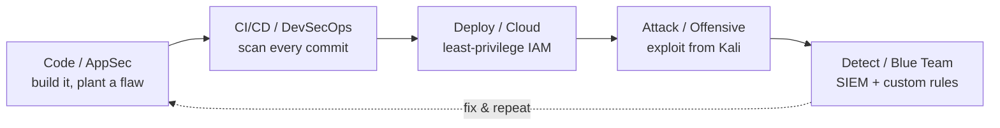
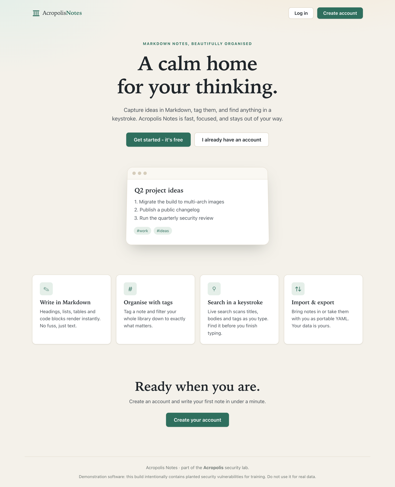
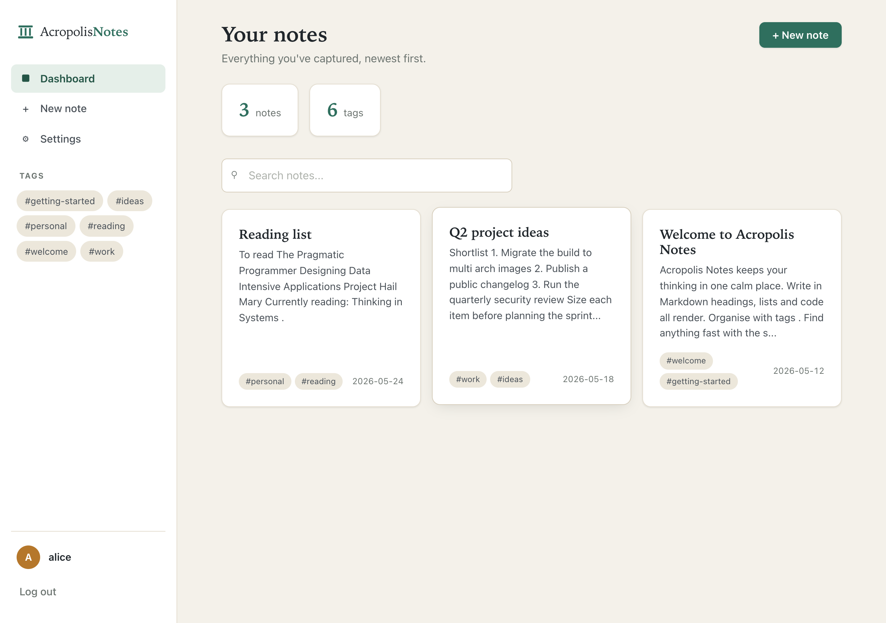
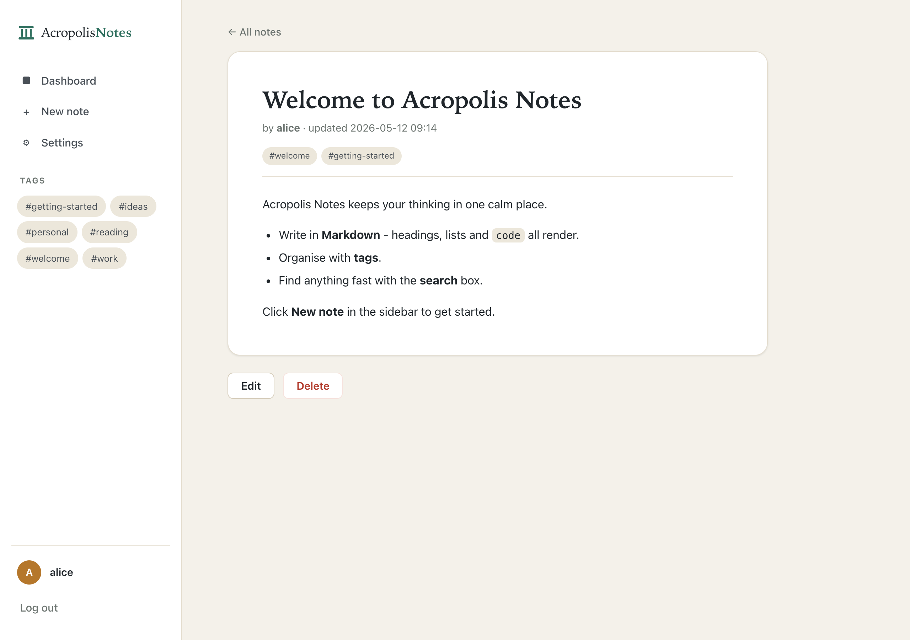

# Acropolis — Multi-Domain Security Lab

> Build it, secure it, attack it, detect it. A single repository that exercises the full secure-SDLC loop across application security, DevSecOps, cloud security, detection engineering, offensive testing, and post-quantum cryptography.


-purple)


> **Status: in active development.** This repository is a living portfolio project. The architecture below is the target design; the roadmap tracks what is built, in progress, and planned. Commits are intentionally incremental so the project documents its own engineering process.

---

## Why this project exists

Most learning labs are isolated, single-skill exercises. Acropolis is the opposite: one application is built, scanned, deployed, attacked, and defended within a single repository, so every security domain is a different lens on the *same* artifact. Fixing a vulnerability in the application code turns the CI/CD pipeline green, silences the SIEM alert, and closes the attack path — all at once. That feedback loop is the point.

The project is designed to demonstrate enterprise-relevant capability end to end, not depth in one tool.

---

## Architecture



The spine is one Git repository. Layered onto the core loop are two cross-cutting modules: a **post-quantum cryptography** module (ML-KEM hybrid key exchange) and an **AI/LLM security** module (a model-backed feature, red-teamed against the OWASP LLM Top 10). Both flow through the same pipeline, deployment, and detection stages as everything else.

The lab is built to run efficiently on Apple Silicon: containers (multi-arch, ARM-native) for the application and tooling, a single Kali Linux VM as the attacker, and a free-tier ARM cloud instance for live, internet-exposed deployment.

---

## What this demonstrates

| Domain | What the lab does | Primary tooling |
| --- | --- | --- |
| Application Security | A purpose-built vulnerable web app with planted flaws (SQLi, IDOR, hardcoded secret, vulnerable dependency); secure code review | Python (Flask/FastAPI) or Node, OWASP Juice Shop |
| DevSecOps | A CI/CD security gate that scans every commit and blocks high-severity findings before merge | GitHub Actions, Semgrep (SAST), Trivy/Grype (SCA + image), gitleaks (secrets), OWASP ZAP (DAST) |
| Cloud Security | Containerized deployment to a live cloud instance under least-privilege IAM and network controls, with one deliberate misconfiguration as an attack surface | Oracle Cloud Always Free (ARM) / AWS, Docker |
| Blue Team / Detection Engineering | Centralized host and network telemetry, dashboards, and custom detection rules written in response to observed attacks | Wazuh (SIEM + HIDS), Suricata (optional NIDS) |
| Offensive Security | A scoped engagement against the live target, then a pivot to detecting the analyst's own footprints | Kali Linux, nmap, sqlmap, Burp Suite, ffuf |
| Post-Quantum Cryptography | A hybrid classical/post-quantum key exchange using the NIST-standardized, IBM-developed ML-KEM (FIPS 203) algorithm | Open Quantum Safe (liboqs, oqs-provider) |
| AI / LLM Security | An LLM-backed application feature, tested for prompt injection and data leakage, then hardened with input/output guardrails | OWASP LLM Top 10, MITRE ATLAS |

---

## Repository structure (planned)

```text
acropolis/
├── app/                  # Deliberately vulnerable application (AppSec)
├── .github/workflows/    # CI/CD security pipeline (DevSecOps)
├── infra/                # Cloud deployment + configuration (Cloud Security)
├── detection/            # Wazuh rules, decoders, dashboards (Blue Team)
├── offensive/            # Attack playbooks and findings (Offensive)
├── pqc/                  # ML-KEM hybrid key-exchange module
├── ai-security/          # LLM feature + red-team notes
├── writeups/             # Per-phase writeups (vuln → exploit → detect → fix)
└── README.md
```

---

## Roadmap

Phase 0 establishes this repository and design. Subsequent phases are sequenced so each builds on the last and closes a loop.

- [x] **Phase 0 — Foundation & design.** Repository, architecture, and roadmap established. Toolchain confirmed (Docker on host, Kali VM as attacker).
- [x] **Phase 1 — Vulnerable application (AppSec).** Built **Acropolis Notes**, a complete Flask notes app with six planted flaws (SQLi, IDOR, insecure deserialization, hardcoded secrets, vulnerable dependency, stored XSS); containerized; exploit regression suite passing 6/6. See below.
- [x] **Phase 2 — Security pipeline (DevSecOps).** GitHub Actions running SAST (Semgrep), SCA + image (Trivy), secret (gitleaks) and DAST (OWASP ZAP) scans on every commit; findings reported to the Security tab (blocking gate deferred to Phase 8). See below.
- [x] **Phase 3 — Cloud deployment (Cloud Security).** Deployed the containerized app to an AWS EC2 free-tier instance (`eu-central-1`) under a least-privilege security group (SSH from one IP), with the container bound to loopback, key-only SSH, and access via an SSH tunnel — **deliberately not exposed** to the public internet. See below.
- [x] **Phase 4 — SIEM (Blue Team).** Deployed a dedicated **Wazuh** SIEM on its own EC2 instance — separate from the monitored host — with a Wazuh agent on the Acropolis box shipping host telemetry to the manager over the VPC's private network; dashboard and agent ports kept off the public internet. See below.
- [x] **Phase 5 — Attack & detect (Offensive + Blue Team loop).** Attacked the live host from Kali across three vectors (SSH brute force, post-compromise host actions, web-layer attacks) and hunted each in Wazuh — surfacing the lab's sharpest lesson: a noisy scan raised ~7,000 alerts while a successful SQLi login bypass raised zero. See below.
- [ ] **Phase 6 — AI/LLM security (in progress).** Added a Gemini-backed **AI Assistant** (`/ai`) with three planted LLM flaws — prompt injection past a weak guard, a secret leaked through the system prompt, and insecure output handling (model-driven XSS). Red-teaming against the OWASP LLM Top 10 and guardrails still to come. See below.
- [ ] **Phase 7 — Post-quantum cryptography.** Implement an ML-KEM hybrid key exchange via Open Quantum Safe; document the link to IBM's FIPS 203 contribution.
- [ ] **Phase 8 — Remediation & publication.** Fix every planted flaw, verify the pipeline goes green and alerts go quiet, record a short demo, publish per-phase writeups.

---

## Phase 1 — Acropolis Notes (Application Security)

The Phase 1 deliverable is **Acropolis Notes**, a server-rendered Flask + SQLite Markdown notes app that doubles as the lab's vulnerable target — a complete, polished product on the surface with deliberately planted flaws underneath. It lives in [`app/`](./app); the full walkthrough is in [`writeups/phase-1-appsec.md`](./writeups/phase-1-appsec.md).

**Product features:** account register / login / logout · Markdown notes with create / view / edit / delete · tags and tag filtering · live client-side search · dashboard with per-account stats and empty states · YAML import / export · settings & profile · a custom, responsive UI (no framework).

**Planted vulnerabilities (by design):** hardcoded secrets · SQL injection (login) · IDOR · insecure YAML deserialization (RCE) · known-vulnerable dependency · stored XSS — plus the bonus flaws `debug=True` and plaintext passwords. An exploit regression suite (`app/test_exploits.py`) asserts all six are still exploitable (**6/6 passing**).

> ⚠️ Acropolis Notes **intentionally** contains planted secrets and exploitable vulnerabilities for security education. Do not deploy it publicly, and do not store real data in it.

| Landing | Dashboard | Note view |
| --- | --- | --- |
| [](docs/screenshots/landing.png) | [](docs/screenshots/dashboard.png) | [](docs/screenshots/note.png) |

---

## Phase 2 — Security pipeline (DevSecOps)

Every push and pull request runs the [`security`](./.github/workflows/security.yml) GitHub Actions workflow — four scanner classes, each aimed at a different failure mode of the app:

- **SAST** — Semgrep statically analyses `app/` for dangerous code patterns (the SQLi, the unsafe `yaml.load`, the hardcoded secret, `debug=True`).
- **Secret scanning** — gitleaks scans the **full git history** for committed keys, so a secret is found even after a later commit "removes" it.
- **SCA** — Trivy scans `requirements.txt` and the built container image for known-vulnerable dependencies and base-image CVEs.
- **DAST** — the OWASP ZAP baseline scan probes the running container.

Because the app is vulnerable *by design*, the pipeline **reports** rather than **blocks**: every job is `continue-on-error`, so CI stays green while the findings still surface (blocking is deferred to Phase 8). Results land in the repo's **Security** tab (SARIF, from Semgrep + Trivy) and as a downloadable **`zap-report.html`** artifact on each Actions run.

The headline finding: the **IDOR is caught by no automated scanner** — it is missing access-control logic, not a dangerous code pattern — which is exactly why OWASP ranks Broken Access Control the #1 web risk. Full catch/miss matrix in [`writeups/phase-2-devsecops.md`](./writeups/phase-2-devsecops.md).

---

## Phase 3 — Cloud deployment (Cloud Security)

Acropolis Notes now runs on a real cloud host — an AWS EC2 `t3.micro` (free tier, Ubuntu 26.04, `eu-central-1`) — so Phases 4–5 have a live target. The defining choice is what is **not** done: the vulnerable app is **never exposed to the public internet**.

Because the app has effectively unauthenticated RCE by design, an open box would be compromised within minutes. So the deployment uses defense in depth — each layer independently enough to keep it off the internet:

- **Security group** — one inbound rule: SSH/22 from the operator's IP only; port 5000 is never opened.
- **Loopback binding** — the container is published to `127.0.0.1:5000` (not `0.0.0.0`), so nothing listens on the public interface even if the firewall were wrong.
- **Key-only SSH, non-root user** — login is the `ubuntu` user by SSH key; password auth is off.
- **SSH-tunnel access** — the app is reached only via `ssh -L 5000:localhost:5000`, so reaching it needs both the key and the allowed source IP.

This host becomes the monitored target in Phase 4 (SIEM) and the attack target in Phase 5, reached through that controlled channel rather than public exposure. A redeploy is one idempotent command ([`infra/deploy.sh`](./infra/deploy.sh)); the runbook is [`infra/deploy.md`](./infra/deploy.md) and the full security-model writeup is [`writeups/phase-3-cloud.md`](./writeups/phase-3-cloud.md).

---

## Phase 4 — Blue Team / SIEM

Phase 3 left a live, locked-down target; Phase 4 gives it a watcher. A dedicated **Wazuh** SIEM runs on its **own** EC2 instance (`m7i-flex.large`, 8 GB) — deliberately *not* on the Acropolis host — so a compromise of the vulnerable app cannot reach the logs that recorded it. Watcher and watched, kept apart:

- **Separate box, same VPC.** The SIEM sits in the same VPC as the target but a different Availability Zone; the agent ships events *off* the host as they happen, beyond an attacker's reach even if they pop the box.
- **Three Wazuh components** (Docker Compose, pinned to `v4.14.5`): the **manager** (analysis + correlation), the **indexer** (OpenSearch storage + search), and the **dashboard** (web UI).
- **Agent on the target.** A Wazuh agent on the Acropolis host performs file-integrity monitoring, log collection, vulnerability/config assessment, and active response — pointed at the manager's **private** IP, so agent↔manager traffic never leaves the VPC.
- **Nothing public, again.** The dashboard (443) is reached only via an SSH tunnel (`-L 8443:localhost:443`); the agent ports (1514/1515) are scoped to the target's private IP only — the same defense-in-depth rule as Phase 3.

This is the defensive instrument Phase 5 will exercise: attack Acropolis Notes from Kali, then hunt the footprints here and write detection rules for the blind spots. The runbook is [`detection/wazuh-deployment.md`](./detection/wazuh-deployment.md); the full architecture and security-model writeup is [`writeups/phase-4-blueteam.md`](./writeups/phase-4-blueteam.md).

---

## Phase 5 — Attack & detect (Offensive + Blue Team loop)

This is where the loop closes. From a Kali VM, the live Acropolis host (Phase 3) is attacked across three vectors; from the Wazuh SIEM (Phase 4), each attack is hunted. All testing is against the author's own lab, over the controlled channel.

- **SSH brute force** (hydra) → caught loudly: an auth-failure burst, Wazuh rule **5712**, then the successful-login pivot **5715** (MITRE **T1110 → T1078**).
- **Post-compromise host actions** → new user (**5902** / T1136), sudo-to-root (**5402**), and real-time **File Integrity Monitoring** (rule **550** with `report_changes`) surfacing the exact line an attacker added to a file.
- **Web-layer attacks** via an nginx reverse proxy (port 80 to the attacker only) → a nikto scan plus GET-based SQLi/XSS/path-traversal triggered ~**7,000** alerts (**31101/31103/31105/31106**).

**The headline finding inverts the intuition.** The *real* attack — the planted POST SQLi login bypass (`' OR '1'='1' --`) — **succeeded** (302, valid session, account takeover) and raised **zero** alerts, because nginx access logs record the URL but never the request body. A useless noisy scan = ~7,000 alerts; a full account takeover = 0: **detection was inversely correlated with danger.** Worse, the session is signed with the hardcoded `SECRET_KEY` (VULN #1), so sessions are forgeable offline. The full engagement, the caught-vs-missed table, and remediation options are in [`writeups/phase-5-attack-detect.md`](./writeups/phase-5-attack-detect.md).

---

## Phase 6 — AI/LLM security (in progress)

The lab's cross-cutting **AI/LLM security** module adds a Gemini-backed **AI Assistant** at `/ai` — a real, model-powered feature with three deliberately planted flaws, mapped to the **OWASP Top 10 for LLM Applications**:

- **Prompt injection past a weak guard (LLM01).** The system prompt protects its secret with nothing but a polite "never reveal" instruction; a crafted user message can talk the model straight past it.
- **System-prompt secret leakage (LLM06).** An admin recovery flag is baked directly into the system prompt, so any injection that coaxes the model into revealing its instructions leaks the secret.
- **Insecure output handling (LLM02).** The model's reply is rendered with Jinja's `|safe` filter, so a model talked into emitting `<script>` produces model-driven stored/reflected XSS.

The Gemini API key is read from the `GEMINI_API_KEY` environment variable (never committed, never written to disk), and the API call uses only the Python standard library — deliberately avoiding the repo's pinned-but-vulnerable `requests`. Red-teaming the assistant against the OWASP LLM Top 10 and adding input/output guardrails are the remaining Phase 6 work.

---

## Post-quantum cryptography module

The two general-purpose NIST post-quantum standards finalized in 2024 — ML-KEM (FIPS 203, formerly CRYSTALS-Kyber) and ML-DSA (FIPS 204, formerly CRYSTALS-Dilithium) — were developed by IBM researchers with industry and academic partners. This module implements a **hybrid key exchange** (a classical algorithm combined with ML-KEM) using the Open Quantum Safe project, demonstrating how systems can migrate to quantum-resistant cryptography today without abandoning current security guarantees.

Scope note: this module covers post-quantum cryptography (software). Quantum Key Distribution is a hardware/photonics discipline and is intentionally out of scope; it is discussed conceptually in the accompanying writeup but not implemented.

---

## Security disclaimer

This repository contains **intentionally vulnerable code and configurations** for educational and demonstration purposes. Do not deploy any component to a production environment or expose it to untrusted networks beyond a controlled lab. All offensive testing documented here was performed exclusively against systems built and owned by the author.

---

## About

Built by `Youssef Fouda` — Computer Science graduate, competitive CTF finalist, focused on DevSecOps, application security, and quantum-safe cryptography.

- LinkedIn: `https://www.linkedin.com/in/youssef-fouda-18a90b309/`
- Writeups: see [`/writeups`](./writeups)

## License

Released under the MIT License. See [`LICENSE`](./LICENSE).
